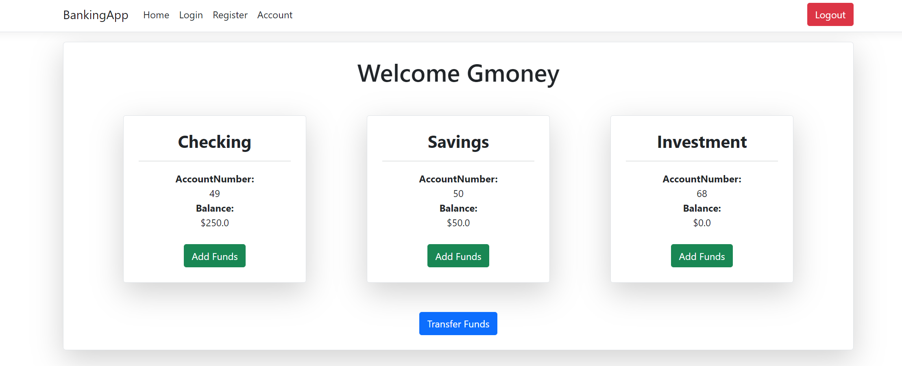
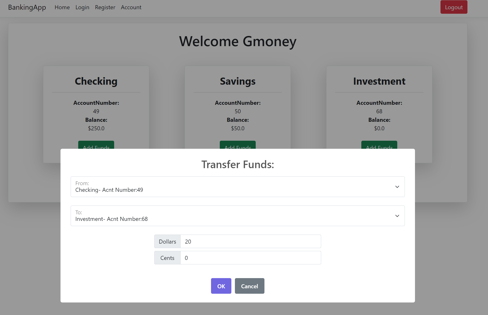
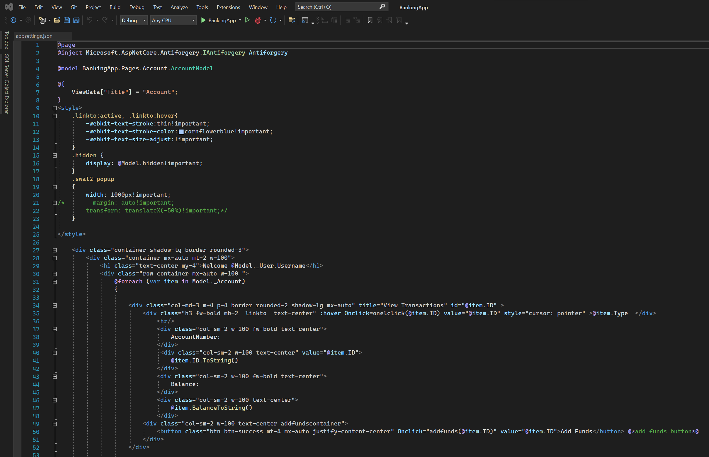
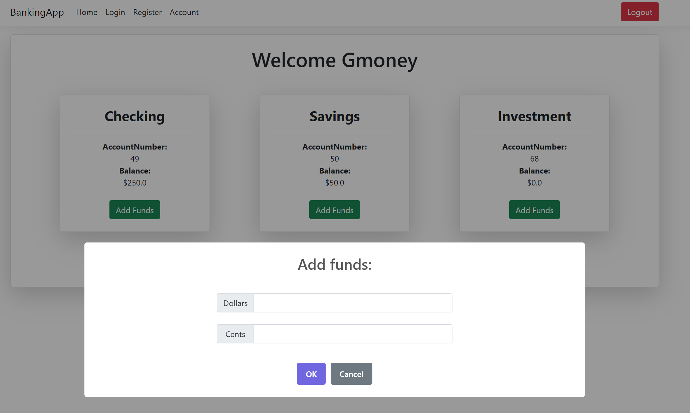

<html>
    <head>
        <link rel="stylesheet" href="https://cdn.jsdelivr.net/npm/bootstrap@4.3.1/dist/css/bootstrap.min.css" integrity="sha384-ggOyR0iXCbMQv3Xipma34MD+dH/1fQ784/j6cY/iJTQUOhcWr7x9JvoRxT2MZw1T" crossorigin="anonymous">
        
<a class="btn btn-secondary" href="https://gkarma5523.github.io/Portfolio/" role="button"><--Back</a>

        <h2>Your Banking App</h2>
    </head>
    <body>
        
The Banking App added a lot of complexity in regards to the back end before and during development. The goal of not only being able to develop a secure means of communication between a user login as well sa communication between client and server is one extra step to increasing security. We like that around here. We utilize C# and .NET to communicate with Entity Framework and pass data back and forth. This is the most insecure part of data which we took into account. To secure this, we incorporated hash and that is salted upon creation of the data transportation.

        

            

                

                    
                    
The main game page.

                

                

                    
                    
Transfering Funds.

                

            

        

        
I feel it is safe to assume most everyone has a bank account or utilized one at one point and as you step through our application, you will see similarities regarding account creation and financial transfers. Being able to have full, secure, control of your money is a top priority! Give it a go, you can add, move, and withdraw finances as you would at your personal bank. There are many ways to fully implement this as it could progress but for the moment, enjoy your endless amount of money.

        
        <h4>Struggles:</h4>
        
I have a strong understanding of C# as I have dealt with it in industry. Understanding the addion of the server and the connection between the two was where I struggled. The team this was developed in spent most of their time designing the server side hosting which moved that task from my plate. That is a goal and improvement that is in the works as the database that this program is tied to belongs to an individual and there for is secured from random client connection. Implementing a secure server database connection will be the next steps on this project.

        

            

                

                    
                    
Adding Funds

                

                

                    
                    
Some of the codebase.

                

            

        

    </body>
</html>
